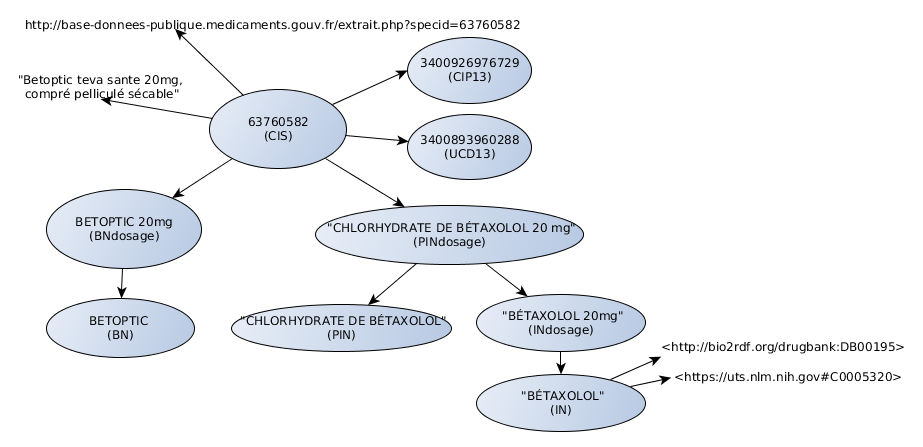

# RomediApp

RomediApp is a set of programs on top of the Romedi terminology, a linked open data on French drugs (https://www.romedi.fr).

The main programs are IAMsystemRomedi that performs semantic annotation of French drugs in textual content and RomediSPARQL that retrieves information about a specific resource.

Local installation is mandatory if you plan to use it with confidential data (e.g. health data).
To test it in your navigator, go to the Romedi website. 
Go to [Using RomediApp](#using-romediapp) to test the APIs in Java, R, Python or Javascript.

## Table of Contents

<!-- toc -->

- [Local installation](#installing-romediapp-locally)
  * [Requirements](#requirements)
  * [Installation](#installation)
- [Using RomediApp](#using-romediapp)
- [LICENSE](#license)
- [Acknowledgement](#acknowledgement)

<!-- tocstop -->

## Installing RomediApp locally
This section gives step-by-step instructions to install and use RomediApp locally.

### Requirements

This is a Java-based application, you need Java 1.8 or above and [Apache Maven](https://maven.apache.org/download.cgi) to compile it. 
Deployment requires a triplestore (RDF database) and a Java Servlet Container. It has only been tested on Ubuntu with  [blazegraph](https://www.blazegraph.com/) or [Virtuoso](https://virtuoso.openlinksw.com/rdf/) triplestore and [tomcat](http://tomcat.apache.org/), an open source Java Servlet Container. 

The following instructions use [docker](https://docs.docker.com/install/) and [docker-compose](https://docs.docker.com/compose/install/) for an easy and fast deployment. 

### Installation

1. Start the docker applications

```
docker-compose up -d
```
Two services will start on port 8889 and 8892 : a blazegraph container and a tomcat container respectively. 

2. Download and load the Romedi Terminology

The Romedi database is in the RDF format (turtle syntax). Go to the Romedi download page on the Romedi website (http://www.romedi.fr/telechargement.html) to download the latest version. Unzip it and place the Romedi-X-Y-Z.ttl file in the ./data/ttl folder (the blazegraph application will load all RDF files in this folder). To do it automatically:
```
cd ./data
bash ./downloadRomedi.sh
```

Then load the turtle file in the container with this script:
```
bash ./loadRomedi.sh
```
If you have installed it on your computer, you can access the blazegraph interface at http://127.0.0.1:8889/bigdata/#namespaces
If you have installed it on a server, the database is only accessible by the localhost for security reason. 

3. Compile the project and copy the war files in the tomcat container

```
mvn clean package
docker cp RomediSPARQLAPI/target/RomediSPARQLAPI-0.1.0.war tomcatRomedi:/usr/local/tomcat/webapps/
docker cp IAMsystemRomediAPI/target/IAMsystemRomediAPI-0.0.1.war tomcatRomedi:/usr/local/tomcat/webapps/
```

RomediApp is now installed locally and you can access its services. 

## Using RomediApp
See the code examples in Java, R, Python and Javascript (NodeJs).

IAMsystemRomedi combines an open-source annotator: [IAMsystem](https://github.com/scossin/IAMsystem) and the Romedi terminology to detect drugs in textual content. RomediSPARQL is used to retrieve information about a specific resource. A SPARQL endpoint is also available at : http://www.romedi.fr:8890/sparql


### Data Model


> Main classes and links. CIS: Drug product code. BN: Brand Name. IN: Ingredient. Ingredients are linked to external resources like DrugBank and UMLS. CIS codes are linked to the summary of product characteristics (http://base-donnees-publique.medicaments.gouv.fr/extrait.php?specid=63760582)

### Updates
To update the terminology, download a new version and replace the turtle file (Romedi-X-Y-Z.ttl) in the ./data/ttl folder. Reload the terminology and restart the containers:
```
cd ./data
bash ./downloadRomedi.sh ## download the latest version and remove previous ttl files
bash ./loadRomedi.sh ## remove the previous graph and load the turtle files in the ./data/ttl folder
cd ../
docker-compose restart
```

## LICENSE

### Data
Romedi is a database derived from "base publique du médicament" (http://base-donnees-publique.medicaments.gouv.fr/telechargement.php). Reuse of the information is covered by the [Open License 2.0](https://github.com/etalab/licence-ouverte/blob/master/open-licence.md) published by Etalab for open data from the State of France. The license is compatible with any free licence that at least requires an acknowledgement of authorship. 

### Code
All the code in this repository is licensed under the MIT license.

## Acknowledgement

Romedi is part of the Drugs Systematized Assessment in real-liFe Environment (DRUGS-SAFE) research platform that is funded by the French Medicines Agency (Agence Nationale de Sécurité du Médicament et des Produits de Santé, ANSM). This platform aims at providing an integrated system allowing the concomitant monitoring of drug use and safety in France.
